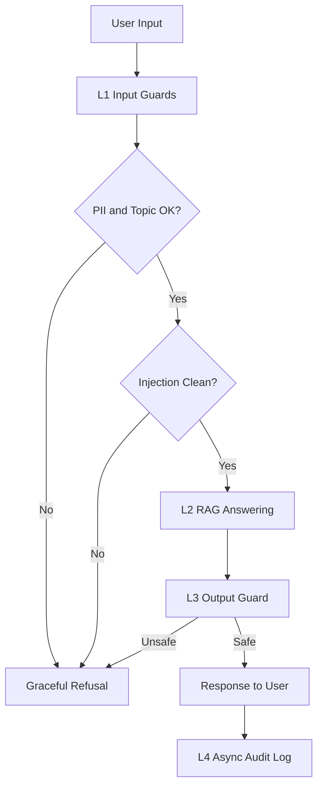

# Lab 24 Blueprint

## Section 1: SLO Definition

| Metric | Target | Alert Threshold | Severity |
|---|---|---|---|
| Faithfulness | >= 0.85 | < 0.80 for 30 min | P2 |
| Answer Relevancy | >= 0.80 | < 0.75 for 30 min | P2 |
| Context Precision | >= 0.70 | < 0.65 for 1h | P3 |
| Context Recall | >= 0.75 | < 0.70 for 1h | P3 |
| P95 Latency with guardrails | < 2500 ms | > 3000 ms for 5 min | P1 |
| Adversarial detection rate | >= 90% | < 85% | P2 |
| False positive rate | < 5% | > 10% | P2 |

## Section 2: Architecture Diagram

Latency annotation:
- L1 target P95: < 50 ms
- L2 target P95: dominated by retrieval/generation
- L3 target P95: < 100 ms
- L4 async: excluded from user-facing latency budget

## Section 3: Alert Playbook

### Incident: Faithfulness drops below 0.80

**Severity:** P2  
**Detection:** Continuous eval gate or scheduled eval run  
**Likely causes:**
1. Retrieved chunks are loosely relevant.
2. Prompt or answer synthesis changed unexpectedly.
3. Corpus changed without re-indexing.

**Investigation steps:**
1. Compare `context_precision` in the same time window.
2. Diff prompt version and generation code.
3. Check document update log and embedding/index refresh status.

**Resolution:**
- Re-index corpus if retrieval degraded.
- Roll back prompt or answer synthesizer if recent change correlates.
- Increase rerank depth for reasoning and multi-context questions.

### Incident: Adversarial detection rate drops below 85%

**Severity:** P2  
**Detection:** Scheduled guardrail regression suite  
**Likely causes:**
1. New injection patterns are missing from pattern matcher.
2. Topic validator lets indirect attacks through.
3. Sanitization chain is applied in the wrong order.

**Investigation steps:**
1. Inspect failed attack samples by category.
2. Check whether injection markers were normalized correctly.
3. Re-run test suite with added payload variants.

**Resolution:**
- Add new signatures and normalization steps.
- Separate injection detection from topic checking.
- Expand regression suite to cover the missed pattern.

### Incident: P95 total latency exceeds 3s

**Severity:** P1  
**Detection:** Runtime latency dashboard  
**Likely causes:**
1. RAG retrieval or generation slowed down.
2. Output guard is running sequentially or waiting on network.
3. Logging path is accidentally blocking the response path.

**Investigation steps:**
1. Compare layer-level timings L1/L2/L3.
2. Confirm output checks remain parallel/asynchronous.
3. Check whether audit logging became synchronous.

**Resolution:**
- Cache retrieval artifacts for repeated queries.
- Move expensive checks behind async boundaries.
- Switch low-risk traffic to a lighter safety tier if needed.

## Section 4: Cost Analysis

Assumption: 100k queries per month.

| Component | Unit Cost | Volume | Monthly Cost |
|---|---|---|---|
| RAG generation | $0.001 / query | 100k | $100 |
| Continuous eval sample | $0.01 / query | 1k | $10 |
| Pairwise judge | $0.001 / query | 10k | $10 |
| Higher-tier calibration judge | $0.05 / query | 1k | $50 |
| PII guard | self-hosted | 100k | $0 |
| Output guard | self-hosted or API | 100k | $50-$216 |
| **Estimated total** | | | **$220-$386** |

Cost optimization opportunities:
- Sample only 1% of production queries for expensive evals.
- Run pairwise judging only on regression candidates.
- Keep regex and keyword guards local; reserve remote models for high-risk cases.
